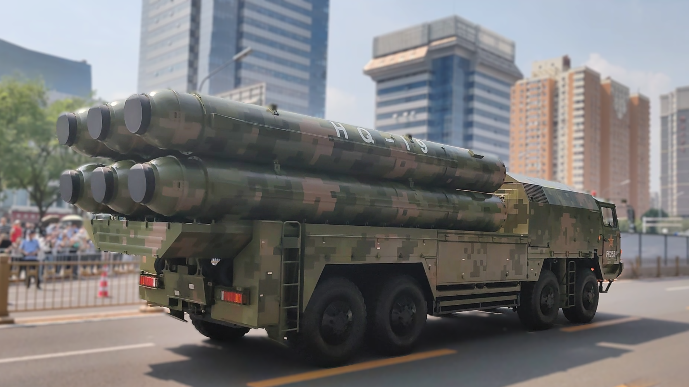
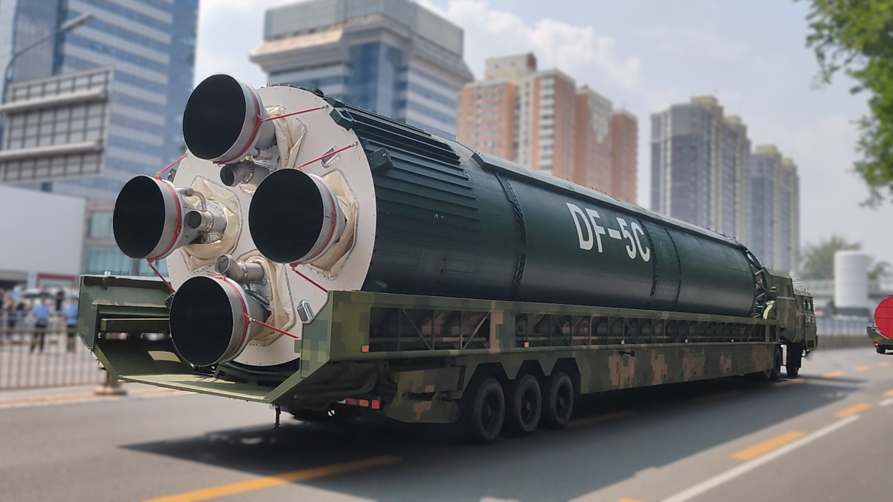

# 九三阅兵装备方队——实拍整理

------

## 目录

- [战旗方队](#战旗方队)
- [1 LZ-陆上作战群](#1-lz-陆上作战群)
  - [1.1 地面突击方队](#11-地面突击方队)
  - [1.2 两栖突击方队](#12-两栖突击方队)
  - [1.3 空降突击方队](#13-空降突击方队)
  - [1.4 远程火炮方队](#14-远程火炮方队)
- [2 HZ-海上作战群](#2-hz-海上作战群)
  - [2.1 舰载防空武器方队](#21-舰载防空武器方队)
  - [2.2 反舰导弹方队](#22-反舰导弹方队)
  - [2.3 水下兵器方队](#23-水下兵器方队)
- [3 FK-防空反导群](#3-fk-防空反导群)
  - [3.1 预警探测方队](#31-预警探测方队)
  - [3.2 对空抗击方队](#32-对空抗击方队)
  - [3.3 反无人机方队](#33-反无人机方队)
- [4 XZ-信息作战群](#4-xz-信息作战群)
  - [4.1 网络空间作战方队](#41-网络空间作战方队)
  - [4.2 电子对抗方队](#42-电子对抗方队)
  - [4.3 信息支援方队](#43-信息支援方队)
- [5 WR-无人作战群](#5-wr-无人作战群)
  - [5.1 陆上无人作战方队](#51-陆上无人作战方队)
  - [5.2 海上无人作战方队](#52-海上无人作战方队)
  - [5.3 空中无人作战方队](#53-空中无人作战方队)
- [6 HF-后装保障群](#6-hf-后装保障群)
  - [6.1 后勤保障方队](#61-后勤保障方队)
  - [6.2 装备保障方队](#62-装备保障方队)
- [7 ZL-战略打击群](#7-zl-战略打击群)
  - [7.1 巡航导弹方队](#71-巡航导弹方队)
  - [7.2 高超声速导弹方队](#72-高超声速导弹方队)
  - [7.3 核导弹第一方队](#73-核导弹第一方队)
  - [7.4 核导弹第二方队](#74-核导弹第二方队)
- [ZB 战备车辆](#zb-战备车辆)
- [空中梯队](#空中梯队)
- [版权使用与说明](#版权使用与说明)

------

### 【战旗方队】

> 东风“猛士”军车

------

### 【1】LZ-陆上作战群

#### 1.1 地面突击方队

99B主战坦克

> 125毫米滑膛炮，高射机枪换为遥控武器站，信息化、智能化水平提升

100坦克、100支援战车

> 100坦克配备无人炮塔、105毫米主炮，遥控武器站，混动；全球首款全向主动防御系统GL6，高信息化、集成化、态势感知能力强
>
> 100支援战车配备无人操作手，可操控无人侦察车、无人机；与坦克形成火力互补

#### 1.2 两栖突击方队

两栖轮式装甲突击车：

> 11两栖改进型105毫米轮式突击炮

.png)

步兵战车：

> 08两栖改进型轮式步兵战车

.png)

自行榴弹炮：

> 09两栖改进型122毫米自行榴弹炮

#### 1.3 空降突击方队

新一代伞兵战车

空降装甲输送车

综合火力支援车

空降120自行迫榴炮

#### 1.4 远程火炮方队

两型191箱式火箭炮：

> 191式370毫米箱式自行火箭，备弹×8

.png)

> 191式火箭炮底盘远程战役战术火箭弹，备弹×2

------

### 【2】HZ-海上作战群

#### 2.1 舰载防空武器方队

海红旗-9C：

> 中远程

.png)

红旗-16C：

> 中程

.png)

红旗-10A舰空导弹：

> 近程

LY-1舰载激光武器：

> 末端拦截，搭配1130近防炮

#### 2.2 反舰导弹方队

鹰击-15：

> 空射超音速冲压巡航导弹

鹰击-19：

> 超燃冲压高超音速巡航导弹

鹰击-17：

> 舰射乘波体高超音速导弹

鹰击-20：

> 舰射双锥体反舰弹道导弹

#### 2.3 水下兵器方队

AMB012轻型鱼雷：

AJC015助飞鱼雷：

AQA010重型鱼雷：

AQS003A新型特种水雷：

------

### 【3】FK-防空反导群

#### 3.1 预警探测方队

四型国产高机动雷达：

#### 3.2 对空抗击方队

红旗-11：

> 末端防御导弹

红旗-20：

> 反隐身作战防空导弹

.png)

.png)

红旗-22A：

> 中程防空导弹，抗复杂电磁环境、成本低

红旗-9C：

> 末端反导系统，拦截弹道类、飞航类目标

红旗-19：

> 中/末端拦截弹，拦截大气层内/外弹道类、高空高速飞航类目标

红旗-29：

> 洲际中/末端拦截弹，中段反导、反卫星武器

#### 3.3 反无人机方队

激光反无人机系统：

反无弹炮系统：

> 625弹炮合一近程防空系统

> FK-3000防空武器系统

高能激光武器：

高功率微波武器：

> FK-4000防空武器系统，拦截小/微型无人机集群

.png)

------

### 【4】XZ-信息作战群

#### 4.1 网络空间作战方队

*四种型号，包含指挥控制、侦查感知、网电对抗等*

#### 4.2 电子对抗方队

*五种型号*

> 涵盖干扰车、频谱监测车、侦扰一体平台等

.png)

#### 4.3 信息支援方队

战场网云车、数智赋能车、天地组网车、信息融合车：

> 无线电节点接入车、带无线电接入能力的天地通信车

> 大型卫星通信天线和测控雷达

------

### 【5】WR-无人作战群

#### 5.1 陆上无人作战方队

> 侦打突击、扫雷排爆、班组支援
>

ZRY222：

.png)

ZRZ100：

.png)

GPJ221：

CWB221&机器狼：

.png)

#### 5.2 海上无人作战方队

> 无人潜航器、无人布雷系统
>

HSU1000：

.png)

AJX002：

#### 5.3 空中无人作战方队

攻击-11、攻击-2

无人直升机

无人僚机

制空作战无人机

------

### 【6】HF-后装保障群

#### 6.1 后勤保障方队

野战急救车：

.png)

野战帐篷医院系统：

运加油系统：

基地化热食快餐保障系统：

#### 6.2 装备保障方队

新型抢修车：

轮式装备抢救抢修车：

.png)

拆装修理车：

机电检测维修车：

------

### 【7】ZL-战略打击群

#### 7.1 巡航导弹方队

长剑-20A：

> 亚音速空射巡航导弹

.png)

鹰击-18C：

> 潜/舰射隐身亚音速巡航导弹

.png)

长剑-1000：

> 远程高超音速巡航导弹

#### 7.2 高超声速导弹方队

鹰击-21：

> 双锥体战术导弹，反舰、可空射

.png)

东风-17：

> 我国首款乘波体弹头高超音速导弹，突防能力极强

.png)

东风-26D：

> 双锥体中程弹道导弹，反舰

.png)

#### 7.3 核导弹第一方队

*核三位一体*

惊雷-1：

> 我国首款空基远程导弹

.png)

.png)

巨浪-3：

> 潜射洲际导弹

东风-61：

> 陆基洲际导弹

东风-31BJ：

> 固定发射井陆基洲际导弹

#### 7.4 核导弹第二方队

东风-5C

> 固定发射井液体洲际导弹，可携带10弹头、全球覆盖打击

​	弹头：

​	中部：

​	尾部：

------

### 【ZB】战备车辆

.png)

.png)

------

### 【空中梯队】

*距离较远，所拍机型部分系推测*

预警指挥机梯队

> 空警500A——空军
>
> 空警600——海军

特种机梯队

> 运-9反潜巡逻机、运-9电子侦察机、运-9雷达干扰机

运输机梯队

> 运-20A、运-20B

轰炸机梯队

> 轰-6N、轰-6K、轰-6J

加受油机梯队

> 运油-20A

歼击机梯队

> 歼-16D、歼-20、歼-20A、歼-20S、歼-35A

舰载机梯队

> 歼-15DH、歼-15DT、歼-35、歼-15T

教练机梯队

> 7架歼-10，由空军八一飞行表演队驾驶

---
>### 版权使用与说明
> 2025-09-03　北京·石景山路  
> © 2025 笔名「Mark Lee」保留所有权利。  
> 本文件仅供个人学习、非商业科普交流；禁止转载以及任何形式的商业使用。
